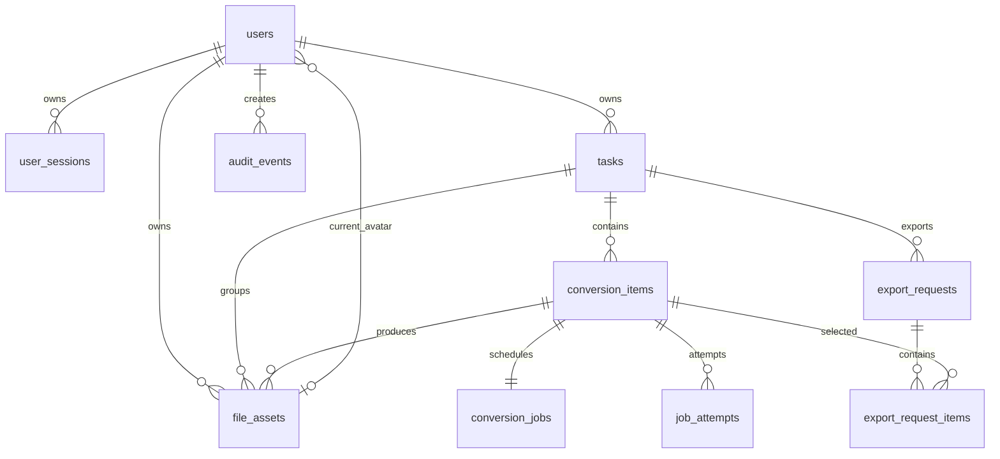

# DocShift 数据库设计

## 1. 文档范围

本文定义 DocShift MVP 的逻辑数据模型、表结构、约束、索引和关键事务。数据库产品及版本见《技术选型.md》；本文按关系型数据库设计，并以 PostgreSQL 推荐方案表达类型和并发语义。

尚未确认的登录方式、文件保留期限、导出打包方式等，不在表结构中擅自固定；相关位置均标注为待确认或可选表。

## 2. 设计原则

- 业务主键统一使用 UUID，由服务端生成。
- 表名、字段名使用小写下划线命名。
- 时间统一存储为带时区时间，接口统一输出 UTC ISO 8601。
- 用户名和邮箱同时保存原始展示值与规范化值，唯一约束建立在规范化值上。
- 大文件不写入数据库；数据库只保存文件元数据和相对路径。
- 文件真实路径由存储根目录和数据库相对路径组合，数据库不保存后端绝对路径。
- 状态字段使用字符串加检查约束，便于后续扩展和迁移。
- 逻辑删除先撤销访问权限，物理文件由清理任务处理。
- 转换项与待执行任务必须在同一数据库事务内创建。
- 验证码、登录令牌等敏感值只保存摘要。

## 3. 实体关系



`email_verifications` 在用户创建之前也需要存在，因此通过规范化邮箱关联业务流程，不强制外键到 `users`。

## 4. 用户与身份模块表

### 4.1 users

保存正式用户的基础资料和状态。

| 字段 | 类型 | 约束 | 说明 |
| --- | --- | --- | --- |
| `user_id` | UUID | 主键 | 用户唯一标识。 |
| `username` | VARCHAR(64) | 非空 | 用户展示名称。长度上限为设计建议，最终规则待确认。 |
| `username_normalized` | VARCHAR(64) | 非空、唯一 | 用于大小写无关的唯一校验。 |
| `email` | VARCHAR(320) | 非空 | 用户展示邮箱。 |
| `email_normalized` | VARCHAR(320) | 非空、唯一 | 规范化邮箱，用于查询和唯一校验。 |
| `email_verified_at` | TIMESTAMPTZ | 非空 | 首次邮箱验证成功时间。 |
| `avatar_asset_id` | UUID | 可空、外键 | 当前头像文件资产。文件资产表创建后补充外键。 |
| `status` | VARCHAR(16) | 非空 | `active`、`disabled`。 |
| `created_at` | TIMESTAMPTZ | 非空 | 创建时间。 |
| `updated_at` | TIMESTAMPTZ | 非空 | 最后更新时间。 |

关键约束：

- `username_normalized` 唯一。
- `email_normalized` 唯一。
- `avatar_asset_id` 必须指向同一用户、类型为 `avatar` 且状态可用的文件；该跨表规则由应用服务在事务内保证。
- MVP 不创建临时用户记录。

### 4.2 email_verifications

保存邮箱验证码发送与验证状态。

| 字段 | 类型 | 约束 | 说明 |
| --- | --- | --- | --- |
| `verification_id` | UUID | 主键 | 验证请求标识。 |
| `email_normalized` | VARCHAR(320) | 非空 | 接收验证码的规范化邮箱。 |
| `purpose` | VARCHAR(32) | 非空 | MVP 为 `registration`；后续可扩展登录、修改邮箱和找回密码。 |
| `code_digest` | VARCHAR(255) | 非空 | 验证码摘要，不保存明文。 |
| `status` | VARCHAR(16) | 非空 | `pending`、`consumed`、`expired`、`blocked`。 |
| `attempt_count` | INTEGER | 非空、默认 0 | 已验证失败次数。 |
| `sent_at` | TIMESTAMPTZ | 非空 | 邮件发送时间。 |
| `expires_at` | TIMESTAMPTZ | 非空 | 验证码过期时间。 |
| `consumed_at` | TIMESTAMPTZ | 可空 | 成功使用时间。 |
| `request_ip_hash` | VARCHAR(128) | 可空 | 用于风控的 IP 摘要；是否启用待确认。 |

推荐索引：

- `(email_normalized, purpose, status, expires_at DESC)`。
- `(expires_at)`，供过期清理。
- 同一邮箱、同一用途只有最新一条 `pending` 记录有效，旧记录在新验证码发送成功后置为 `expired`。

### 4.3 user_sessions

保存服务端登录会话。无论后续选择密码还是邮箱验证码登录，业务接口都通过该表对应到真实 `user_id`。

| 字段 | 类型 | 约束 | 说明 |
| --- | --- | --- | --- |
| `session_id` | UUID | 主键 | 会话标识。 |
| `user_id` | UUID | 非空、外键 | 所属用户。 |
| `token_digest` | VARCHAR(255) | 非空、唯一 | 浏览器会话令牌摘要。 |
| `created_at` | TIMESTAMPTZ | 非空 | 创建时间。 |
| `last_seen_at` | TIMESTAMPTZ | 非空 | 最近使用时间。 |
| `expires_at` | TIMESTAMPTZ | 非空 | 会话过期时间。 |
| `revoked_at` | TIMESTAMPTZ | 可空 | 主动退出或服务端吊销时间。 |
| `user_agent_hash` | VARCHAR(128) | 可空 | 排障与异常检测辅助信息，不作为唯一身份依据。 |

推荐索引：

- `(user_id, revoked_at, expires_at)`。
- `(expires_at)`，供会话清理。

如果最终确定密码登录，再新增 `user_credentials` 表保存密码哈希、算法参数和修改时间；确认前不加入密码字段。

## 5. Task 模块表

### 5.1 tasks

Task 是用户创建的文档转换工作空间。

| 字段 | 类型 | 约束 | 说明 |
| --- | --- | --- | --- |
| `task_id` | UUID | 主键 | Task 标识。 |
| `user_id` | UUID | 非空、外键 | Task 所有者。 |
| `display_name` | VARCHAR(128) | 可空 | 用户自定义名称；是否开放待确认。 |
| `created_at` | TIMESTAMPTZ | 非空 | 创建时间。 |
| `updated_at` | TIMESTAMPTZ | 非空 | 最近一次内容变化时间。 |
| `expires_at` | TIMESTAMPTZ | 可空 | Task 或结果到期时间，保留策略待确认。 |
| `deleted_at` | TIMESTAMPTZ | 可空 | 预留 Task 逻辑删除时间；MVP 暂无删除 Task 功能。 |

Task 不单独保存可变汇总状态。总数、处理中数、成功数和失败数根据 `conversion_items` 聚合，避免 Task 状态与转换项状态不一致。

推荐索引：

- `(user_id, created_at DESC)`，用于用户 Task 列表。
- `(user_id, task_id)`，用于所有权校验。
- `(expires_at)`，供清理任务扫描。

## 6. 转换模块表

### 6.1 conversion_items

一个转换项表示一个源文件到一个目标格式的独立转换。

| 字段 | 类型 | 约束 | 说明 |
| --- | --- | --- | --- |
| `item_id` | UUID | 主键 | 转换项标识。 |
| `task_id` | UUID | 非空、外键 | 所属 Task。 |
| `source_format` | VARCHAR(32) | 非空 | 服务端识别的源格式。 |
| `target_format` | VARCHAR(32) | 非空 | 用户选择且服务端验证的目标格式。 |
| `route_key` | VARCHAR(64) | 非空 | 转换路由标识，不保存完整命令。 |
| `conversion_options` | JSONB | 非空、默认 `{}` | 受白名单约束的转换配置。 |
| `status` | VARCHAR(24) | 非空 | 当前转换状态。 |
| `error_code` | VARCHAR(64) | 可空 | 对外可映射的失败分类。 |
| `error_message` | VARCHAR(512) | 可空 | 脱敏后的失败摘要。 |
| `version` | INTEGER | 非空、默认 0 | 乐观锁版本，防止并发状态覆盖。 |
| `created_at` | TIMESTAMPTZ | 非空 | 创建时间。 |
| `updated_at` | TIMESTAMPTZ | 非空 | 状态或内容更新时间。 |
| `completed_at` | TIMESTAMPTZ | 可空 | 转换完成时间。 |
| `expires_at` | TIMESTAMPTZ | 可空 | 结果过期时间。 |
| `deleted_at` | TIMESTAMPTZ | 可空 | 用户删除结果时间。 |

允许状态：

```text
uploading
queued
processing
preview_ready
failed
deleted
expired
```

关键约束：

- `source_format` 与 `target_format` 必须在服务端转换矩阵中存在。
- 状态转换只能由转换模块执行，并同时校验 `version`。
- `deleted_at` 非空时状态必须为 `deleted`。
- `preview_ready` 必须存在可用的 `result` 文件资产。

推荐索引：

- `(task_id, created_at)`，用于 Task 详情。
- `(task_id, status)`，用于 Task 汇总统计。
- `(status, expires_at)`，供状态和过期扫描。

Task 汇总查询示意：

```sql
SELECT
    COUNT(*) AS total_count,
    COUNT(*) FILTER (WHERE status IN ('uploading', 'queued', 'processing')) AS processing_count,
    COUNT(*) FILTER (WHERE status = 'preview_ready') AS preview_ready_count,
    COUNT(*) FILTER (WHERE status = 'failed') AS failed_count
FROM conversion_items
WHERE task_id = :task_id
  AND status <> 'deleted';
```

## 7. 文件管理模块表

### 7.1 file_assets

保存文件元数据和相对于存储根目录的路径。

| 字段 | 类型 | 约束 | 说明 |
| --- | --- | --- | --- |
| `asset_id` | UUID | 主键 | 文件资产标识。 |
| `user_id` | UUID | 非空、外键 | 文件所有者。 |
| `task_id` | UUID | 可空、外键 | 所属 Task；头像为空。 |
| `item_id` | UUID | 可空、外键 | 所属转换项；头像与 Task 导出包为空。 |
| `kind` | VARCHAR(32) | 非空 | `avatar`、`source`、`result`、`preview`、`export_package`。 |
| `preview_type` | VARCHAR(32) | 可空 | Markdown、HTML、表格 JSON 等预览类型。 |
| `relative_path` | VARCHAR(1024) | 非空、唯一 | 相对于存储根目录的服务端路径。 |
| `original_filename` | VARCHAR(255) | 非空 | 用户展示和下载文件名。 |
| `content_type` | VARCHAR(128) | 非空 | 经服务端识别的媒体类型。 |
| `file_extension` | VARCHAR(32) | 非空 | 服务端确认的扩展名。 |
| `size_bytes` | BIGINT | 非空、检查 `>= 0` | 文件大小。 |
| `sha256` | CHAR(64) | 非空 | 文件摘要。 |
| `access_state` | VARCHAR(16) | 非空 | `available`、`deleted`、`expired`。 |
| `created_at` | TIMESTAMPTZ | 非空 | 创建时间。 |
| `expires_at` | TIMESTAMPTZ | 可空 | 到期时间。 |
| `deleted_at` | TIMESTAMPTZ | 可空 | 撤销访问时间。 |
| `physical_deleted_at` | TIMESTAMPTZ | 可空 | 物理文件删除完成时间。 |

关键约束：

- `relative_path` 必须由服务端生成，并通过路径规范化校验确保位于存储根目录内。
- `kind = 'avatar'` 时 `task_id`、`item_id` 均为空。
- `kind IN ('source', 'result', 'preview')` 时 `task_id`、`item_id` 均非空。
- `kind = 'export_package'` 时 `task_id` 非空、`item_id` 为空。
- 一个转换项只能有一个可用 `source` 和一个可用 `result`，可有多个 `preview`。

推荐索引：

- `(user_id, access_state)`。
- `(task_id, access_state)`。
- `(item_id, kind, access_state)`。
- `(access_state, expires_at)`，供清理任务扫描。
- PostgreSQL 推荐使用部分唯一索引，约束每个转换项唯一的可用源文件和结果文件。

## 8. 任务调度与 Worker 模块表

### 8.1 conversion_jobs

保存转换项当前的异步执行任务。

| 字段 | 类型 | 约束 | 说明 |
| --- | --- | --- | --- |
| `job_id` | UUID | 主键 | 调度任务标识。 |
| `item_id` | UUID | 非空、唯一、外键 | 对应转换项。 |
| `state` | VARCHAR(16) | 非空 | `queued`、`leased`、`completed`、`failed`、`cancelled`。 |
| `available_at` | TIMESTAMPTZ | 非空 | 可被领取时间。 |
| `lease_owner` | VARCHAR(128) | 可空 | 当前 Worker 实例标识。 |
| `lease_expires_at` | TIMESTAMPTZ | 可空 | 执行租约过期时间。 |
| `attempt_count` | INTEGER | 非空、默认 0 | 已执行次数。 |
| `max_attempts` | INTEGER | 非空 | 最大执行次数，默认值待确认。 |
| `last_error_code` | VARCHAR(64) | 可空 | 最近一次失败分类。 |
| `created_at` | TIMESTAMPTZ | 非空 | 创建时间。 |
| `updated_at` | TIMESTAMPTZ | 非空 | 更新时间。 |

推荐领取索引：

- `(state, available_at, created_at)`。
- `(lease_expires_at)`，供租约回收。

Worker 领取任务时使用数据库行锁跳过已锁定记录：

```sql
SELECT job_id
FROM conversion_jobs
WHERE state = 'queued'
  AND available_at <= NOW()
ORDER BY created_at
FOR UPDATE SKIP LOCKED
LIMIT 1;
```

领取和写入租约必须在同一事务内完成。

### 8.2 job_attempts

记录每次实际执行，用于重试判断和问题定位。

| 字段 | 类型 | 约束 | 说明 |
| --- | --- | --- | --- |
| `attempt_id` | UUID | 主键 | 执行记录标识。 |
| `job_id` | UUID | 非空、外键 | 所属调度任务。 |
| `item_id` | UUID | 非空、外键 | 冗余保存，便于查询。 |
| `attempt_no` | INTEGER | 非空 | 第几次执行。 |
| `worker_id` | VARCHAR(128) | 非空 | Worker 实例标识。 |
| `route_key` | VARCHAR(64) | 非空 | 本次转换路由。 |
| `engine_version` | VARCHAR(128) | 可空 | 实际执行工具版本。 |
| `started_at` | TIMESTAMPTZ | 非空 | 开始时间。 |
| `finished_at` | TIMESTAMPTZ | 可空 | 结束时间。 |
| `outcome` | VARCHAR(16) | 可空 | `succeeded`、`retryable`、`failed`。 |
| `error_code` | VARCHAR(64) | 可空 | 失败分类。 |
| `error_message` | VARCHAR(512) | 可空 | 脱敏摘要。 |

唯一约束：`(job_id, attempt_no)`。

## 9. 结果管理模块表

### 9.1 export_requests

记录按 Task 发起的导出请求。无论最终采用逐文件下载还是压缩包，都可以保留统一的审计与授权边界。

| 字段 | 类型 | 约束 | 说明 |
| --- | --- | --- | --- |
| `export_id` | UUID | 主键 | 导出请求标识。 |
| `task_id` | UUID | 非空、外键 | 所属 Task。 |
| `user_id` | UUID | 非空、外键 | 发起用户。 |
| `scope` | VARCHAR(16) | 非空 | `selected` 或 `all_available`。 |
| `delivery_mode` | VARCHAR(16) | 非空 | `direct` 或 `archive`，最终策略待确认。 |
| `state` | VARCHAR(16) | 非空 | `preparing`、`ready`、`failed`、`expired`、`invalidated`。 |
| `package_asset_id` | UUID | 可空、外键 | 压缩包文件；逐文件模式为空。 |
| `error_code` | VARCHAR(64) | 可空 | 失败分类。 |
| `created_at` | TIMESTAMPTZ | 非空 | 创建时间。 |
| `ready_at` | TIMESTAMPTZ | 可空 | 可下载时间。 |
| `expires_at` | TIMESTAMPTZ | 可空 | 导出结果到期时间。 |

### 9.2 export_request_items

冻结本次导出的结果集合，避免导出过程中 Task 内容变化。

| 字段 | 类型 | 约束 | 说明 |
| --- | --- | --- | --- |
| `export_id` | UUID | 联合主键、外键 | 导出请求。 |
| `item_id` | UUID | 联合主键、外键 | 被选中的转换项。 |
| `result_asset_id` | UUID | 非空、外键 | 发起导出时对应的结果文件。 |
| `created_at` | TIMESTAMPTZ | 非空 | 加入导出集合时间。 |

创建导出请求时必须校验这些结果都属于相同 Task、相同用户，并且状态可用。

## 10. 清理与审计模块表

### 10.1 audit_events

保存关键业务操作的审计记录。

| 字段 | 类型 | 约束 | 说明 |
| --- | --- | --- | --- |
| `event_id` | UUID | 主键 | 审计事件标识。 |
| `user_id` | UUID | 可空、外键 | 操作用户；注册失败等场景可为空。 |
| `task_id` | UUID | 可空、外键 | 关联 Task。 |
| `item_id` | UUID | 可空、外键 | 关联转换项。 |
| `event_type` | VARCHAR(64) | 非空 | 事件类型。 |
| `request_id` | VARCHAR(128) | 可空 | 对应请求标识。 |
| `result` | VARCHAR(16) | 非空 | `succeeded` 或 `failed`。 |
| `metadata` | JSONB | 非空、默认 `{}` | 脱敏扩展信息。 |
| `created_at` | TIMESTAMPTZ | 非空 | 发生时间。 |

`metadata` 禁止保存验证码、会话令牌、文档正文、SMTP 授权信息和服务器绝对路径。

推荐索引：

- `(user_id, created_at DESC)`。
- `(task_id, created_at DESC)`。
- `(item_id, created_at DESC)`。
- `(event_type, created_at DESC)`。

## 11. 关键事务与一致性

### 11.1 注册事务

1. 锁定尚未使用且未过期的邮箱验证码记录。
2. 校验验证码摘要、状态、过期时间和尝试次数。
3. 再次校验用户名、邮箱唯一性。
4. 创建用户并将验证码置为 `consumed`。
5. 是否同时创建登录会话，取决于最终登录方案。

步骤 1 至 4 必须在同一事务内完成。

### 11.2 上传与创建转换项

文件系统与数据库不能共用事务，因此采用“临时文件 + 数据库事务 + 补偿清理”：

1. 上传内容写入受控临时文件并完成格式、大小和摘要校验。
2. 服务端生成最终相对路径，并将临时文件原子移动到目标目录。
3. 在一个数据库事务中创建 `conversion_items`、`file_assets` 和 `conversion_jobs`。
4. 数据库事务失败时删除目标文件；删除失败则由孤儿文件清理任务回收。

### 11.3 Worker 完成事务

1. Worker 将结果和预览写入临时目录并完成完整性校验。
2. 原子移动到最终目录。
3. 在同一数据库事务中创建结果/预览资产、完成执行记录、完成任务并将转换项更新为 `preview_ready`。
4. 数据库提交失败时保留补偿清理记录，不能把转换项错误标记为成功。

### 11.4 删除结果事务

1. 校验 `user_id`、Task 所有权和转换项状态。
2. 在同一数据库事务中把结果/预览资产置为 `deleted`，并把转换项置为 `deleted`。
3. 将包含该结果的未过期导出请求置为 `invalidated`，对应导出包同时撤销访问。
4. 事务提交后，结果、预览和失效导出包立即不能通过 API 访问。
5. 清理任务异步删除物理文件并写入 `physical_deleted_at`。

### 11.5 替换头像事务

1. 新头像先写入新资产路径，不覆盖旧文件。
2. 在同一事务中创建新头像资产、更新 `users.avatar_asset_id`、把旧头像资产标记为 `deleted`。
3. 提交成功后再异步删除旧头像；失败时保留原头像引用。

## 12. 数据保留与清理

- 过期扫描以 `expires_at` 和访问状态为依据。
- 清理流程先更新数据库访问状态，再删除物理文件。
- 物理删除失败可重试，不能恢复用户访问。
- 会话、验证码、失败任务、审计日志和导出记录应分别配置保留期限。
- 具体保留天数、清理频率以及删除结果时是否同步删除源文件待确认。

## 13. 迁移与版本管理

- 所有表结构变更必须通过有序数据库迁移执行。
- 迁移脚本执行记录保存在独立的 schema version 表。
- 新增非空字段时先允许为空、回填数据、再增加非空约束。
- 状态值扩展应先部署兼容读取的新版本服务，再写入新状态。
- 删除字段或表前应先停止读写并保留一个稳定观察周期。

## 14. 待确认事项

1. 是否正式采用 PostgreSQL；若采用，需要确认具体版本。
2. 注册后的登录方式；如果使用密码，需要补充 `user_credentials` 表设计。
3. 用户名、Task 名称、上传文件、头像等字段的最终长度和大小限制。
4. 文件、会话、验证码、导出记录和审计日志的保留期限。
5. 导出采用逐文件下载还是压缩包；这决定 `package_asset_id` 的实际使用方式。
6. Task 是否支持用户主动删除；当前仅预留 `deleted_at`。
