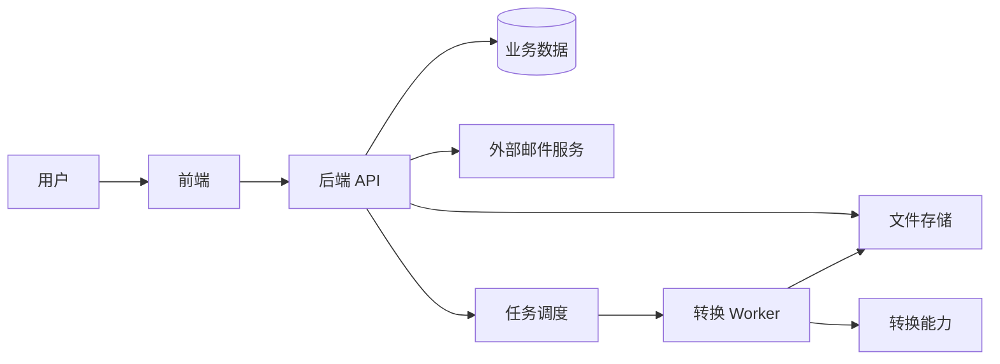
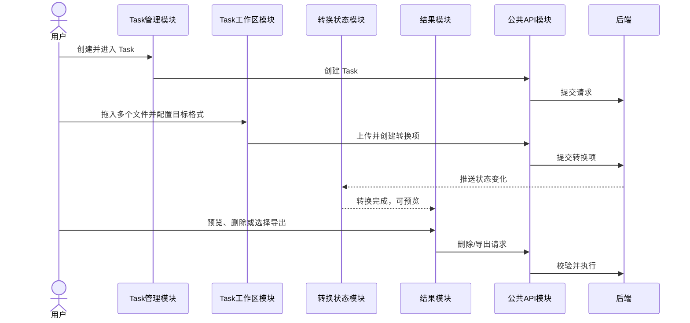
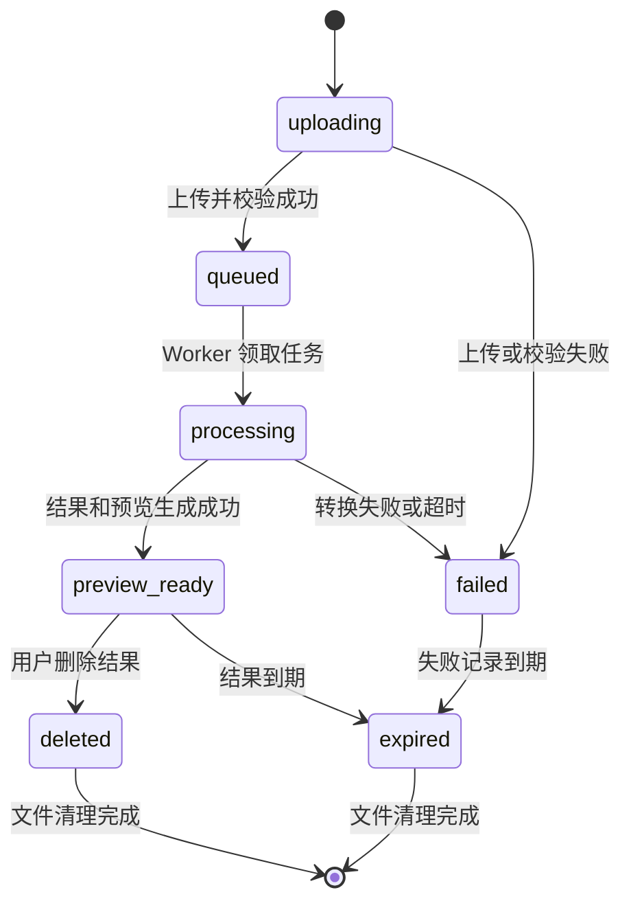
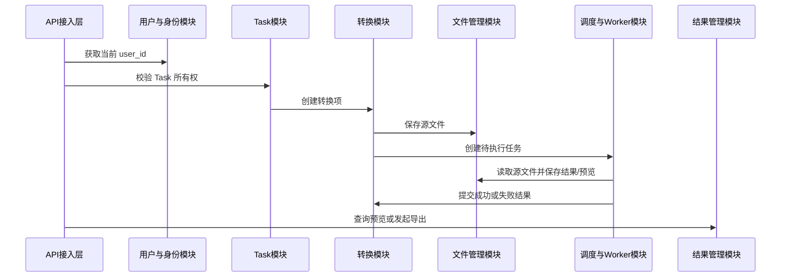

# DocShift 架构设计

## 1. 文档边界

本文从前端和后端两部分描述系统架构，重点说明各模块的职责、边界以及模块之间如何协作。

- 框架、语言、转换工具和依赖版本见《技术选型.md》。
- 用户可见功能及验收范围见《功能文档.md》。
- 状态机、删除规则、异常处理等细节归入对应业务模块，不作为独立架构层级。

## 2. 系统边界



前端只通过后端 API 访问业务数据和文件。转换工具、数据库以及后端真实文件路径均不直接暴露给浏览器。

# 第一部分：前端架构

## 3. 前端分层

前端按“页面入口 → 业务模块 → 公共能力”组织：

```text
页面与路由
  ├── 账户与用户模块
  ├── Task 管理模块
  ├── Task 工作区模块
  ├── 转换状态模块
  └── 结果预览与导出模块

公共能力
  ├── API 请求
  ├── 登录态与路由保护
  ├── 状态事件订阅
  ├── 错误提示
  └── 通用 UI 组件
```

页面只负责组合业务模块，不直接拼接接口参数或处理底层网络错误；接口访问统一由公共 API 能力完成。

## 4. 前端业务模块

### 4.1 账户与用户模块

职责：

- 提供注册、邮箱验证码输入和登录入口。
- 维护当前用户的登录状态和基础资料。
- 展示、上传和替换用户头像。
- 登录失效时清理用户态，并引导用户重新登录。

协作关系：

- 调用后端“用户与身份模块”完成注册、登录态验证和资料修改。
- 调用后端“文件管理模块”间接完成头像存储；前端不接触头像真实路径。
- 向其他前端模块提供当前用户信息和登录状态。

### 4.2 Task 管理模块

职责：

- 展示当前用户创建的 Task 列表。
- 创建 Task 并进入对应工作区。
- 展示每个 Task 的转换项数量、成功数、失败数和处理中数量。

协作关系：

- 从账户与用户模块获得当前用户状态。
- 调用后端“Task 模块”创建和查询 Task。
- 用户进入 Task 后，将控制权交给 Task 工作区模块。

### 4.3 Task 工作区模块

职责：

- 提供多文件选择和拖拽待转换区。
- 展示文件名、文件大小、源格式和上传进度。
- 为每个文件选择目标格式，也可对兼容文件批量设置目标格式。
- 将一个 Task 中的不同文件创建为互相独立的转换项。

模块内流程：

```text
添加文件 → 前端初步校验 → 选择目标格式 → 上传 → 创建转换项
```

单个文件上传或校验失败，只更新当前文件行，不阻塞同一 Task 内其他文件。

### 4.4 转换状态模块

职责：

- 展示 Task 汇总状态和每个转换项的独立状态。
- 接收后端状态事件，更新上传、排队、转换、待预览、失败和过期状态。
- 状态推送不可用时，退化为定时查询。
- 将后端错误码转换为用户可理解的错误提示，不展示内部路径或命令信息。

该模块不决定状态如何流转，只展示后端“转换模块”返回的最终状态。

### 4.5 结果预览与导出模块

职责：

- 根据结果类型选择对应的只读预览组件。
- 允许用户删除不满意的已完成转换项。
- 允许用户选择一个、多个或当前 Task 的全部可用结果导出。
- 已删除或过期的结果从可预览、可导出集合中移除。

模块内规则：

- 删除前必须二次确认。
- 转换完成后只展示预览，不自动下载。
- “导出到本地”由用户主动触发浏览器下载。
- 前端不直接读取服务端文件目录。

## 5. 前端公共模块

| 公共模块 | 职责 |
| --- | --- |
| 路由与页面模块 | 组织注册、登录、用户资料、Task 列表和 Task 工作区页面。 |
| 登录态模块 | 保存当前登录状态，保护需要登录的路由，统一处理登录失效。 |
| API 模块 | 统一请求头、响应解析、错误处理和请求取消。 |
| 事件订阅模块 | 订阅 Task/转换项状态变化，并把事件分发给状态模块。 |
| 通用 UI 模块 | 文件拖拽区、进度条、状态标签、确认框、表格和提示信息。 |

业务模块不得绕过 API 模块直接访问后端，也不得自行保存服务器文件地址。

## 6. 前端模块协作流程



# 第二部分：后端架构

## 7. 后端分层与模块划分

后端分为 API 接入层、业务模块层和基础能力层。

```text
API 接入层
  └── 路由、参数解析、登录态解析、统一响应

业务模块层（8 个模块）
  ├── 1. 用户与身份模块
  ├── 2. Task 模块
  ├── 3. 转换模块
  ├── 4. 文件管理模块
  ├── 5. 结果管理模块
  ├── 6. 任务调度与 Worker 模块
  ├── 7. 邮件模块
  └── 8. 清理与审计模块

基础能力层
  └── 数据持久化、文件系统、日志、配置、时间与错误码
```

每个业务模块内部统一按以下职责组织：

```text
接口适配 → 应用服务 → 领域规则 → 数据/外部服务适配
```

一个模块不得直接修改另一个模块负责的数据，应通过对方提供的应用服务协作。

## 8. 用户与身份模块

### 8.1 职责

- 管理用户注册、邮箱首次验证和登录态。
- 管理用户名、邮箱、邮箱验证状态和头像引用。
- 为其他业务模块提供可信的当前 `user_id`。
- 校验用户名和邮箱唯一性。

### 8.2 模块协作

- 调用邮件模块发送注册验证码。
- 调用文件管理模块保存或替换头像。
- Task 模块、结果管理模块通过本模块获得当前用户身份。

### 8.3 注册流程

```text
请求验证码
  → 校验邮箱格式和发送频率
  → 邮件模块发送验证码
  → 保存验证码摘要和有效期
  → 用户提交用户名、邮箱、验证码
  → 校验验证码及唯一性
  → 创建或激活用户
```

验证码只保存摘要，具有有效期和单次使用属性。注册后的具体登录方式仍待确认。

## 9. Task 模块

### 9.1 职责

- 创建、查询和汇总当前用户的 Task。
- 维护 Task 与 `user_id` 的所有权关系。
- 管理 Task 与转换项的包含关系。
- 汇总 Task 内成功、失败、处理中、待预览和过期数量。

### 9.2 模块规则

- Task 必须归属于一个已验证用户。
- 同一 Task 可以包含不同源格式和不同目标格式的转换项。
- Task 汇总状态由转换项状态计算，不单独驱动转换流程。
- 一个转换项失败或被删除，不影响同一 Task 中其他转换项。

### 9.3 模块协作

- 从用户与身份模块取得当前 `user_id`。
- 调用转换模块创建和查询 Task 内的转换项。
- 调用结果管理模块导出 Task 中保留的结果。

## 10. 转换模块

### 10.1 职责

- 校验源格式与目标格式组合。
- 为上传文件创建独立转换项。
- 维护转换项状态、失败分类和执行记录。
- 为任务调度与 Worker 模块提供待执行任务。
- 在转换完成后关联结果文件和预览文件。

### 10.2 转换项状态机

状态机属于转换模块内部规则：



状态转换只能由转换模块提供的方法完成，前端、Worker 或其他模块不能直接修改状态字段。

### 10.3 异常规则

- 格式不支持、文件损坏和密码保护属于不可重试失败。
- Worker 异常退出、临时文件读取失败属于可重试失败。
- 达到重试上限后进入 `failed`。
- 单项失败仅记录当前转换项，不改变同一 Task 的其他项。

## 11. 文件管理模块

### 11.1 职责

- 为用户、Task 和转换项创建受控目录。
- 保存头像、源文件、转换结果、预览文件和导出文件。
- 根据文件资产标识读取文件，不接受外部传入的绝对路径。
- 管理文件的可访问、已删除和已过期状态。

### 11.2 目录规则

```text
users/{user_id}/profile/avatar/{asset_id}
users/{user_id}/tasks/{task_id}/items/{item_id}/source/{asset_id}
users/{user_id}/tasks/{task_id}/items/{item_id}/result/{asset_id}
users/{user_id}/tasks/{task_id}/items/{item_id}/preview/{asset_id}
users/{user_id}/tasks/{task_id}/exports/{export_id}
```

目录和文件名均由服务端生成。用户上传的原始文件名只用于展示和下载，不能参与实际路径拼接。

### 11.3 删除规则

删除规则属于文件管理模块与转换模块的协作流程：

1. 转换模块确认该转换项允许删除。
2. 文件管理模块把结果和预览资产标记为不可访问。
3. 转换模块将转换项状态更新为 `deleted`。
4. 清理与审计模块异步物理删除文件。

任一步骤失败都不能重新开放已经撤销的文件访问权限。

## 12. 结果管理模块

结果管理模块包含预览和导出两个子能力。

### 12.1 预览子模块

- 校验当前用户、Task、转换项和结果之间的所有权关系。
- 根据结果类型返回对应的只读预览数据。
- 隔离可能包含脚本的预览内容。
- 已删除、失败或过期的结果不能预览。

### 12.2 导出子模块

- 导出一个或多个指定结果。
- 导出当前 Task 中全部未删除且未过期的结果。
- 导出前再次校验每个结果的用户归属和可访问状态。
- 具体采用逐文件下载还是生成压缩包，待后续确认。

结果管理模块只负责授权和组织结果，不直接执行文档转换。

## 13. 任务调度与 Worker 模块

### 13.1 任务调度职责

- 在转换项创建成功后生成待执行任务。
- 保证多个 Worker 不会同时领取同一个转换项。
- 管理执行租约、超时、重试次数和执行记录。
- Worker 异常退出后回收超时任务。

### 13.2 Worker 职责

```text
领取任务
  → 创建独立临时目录
  → 读取源文件
  → 调用对应转换能力
  → 生成结果与预览
  → 文件管理模块保存资产
  → 转换模块更新状态
  → 清理临时目录
```

Worker 不提供公开 API，也不负责用户鉴权、Task 管理或导出。

## 14. 邮件模块

### 14.1 职责

- 接收用户与身份模块的验证码发送请求。
- 使用配置的发件账户调用外部邮件服务。
- 返回发送成功或可识别的失败分类。
- 记录脱敏后的发送日志。

### 14.2 边界

- 邮件模块不创建用户、不判断验证码是否正确。
- 发件账户和授权信息只能从安全配置读取。
- 验证码原文不能写入日志。

## 15. 清理与审计模块

### 15.1 清理职责

- 清理已删除和已过期的结果、预览及临时文件。
- 清理异常中断后遗留的临时目录。
- 在物理删除失败时保留待重试记录。

### 15.2 审计职责

- 记录注册、头像更新、Task 创建、转换项创建、删除和导出等关键操作。
- 日志关联 `user_id`、`task_id`、`item_id` 和请求标识。
- 不记录文档正文、验证码、授权信息和服务器完整路径。

## 16. 后端模块协作流程

### 16.1 创建并执行转换项



### 16.2 删除转换结果

```text
API 接入层
  → 用户与身份模块识别 user_id
  → Task 模块校验 Task 所有权
  → 转换模块校验当前状态
  → 文件管理模块撤销文件访问
  → 转换模块标记 deleted
  → 清理与审计模块异步删除并记录操作
```

## 17. 数据关系

```text
User 1 ── N Task 1 ── N ConversionItem
  │                        │
  │                        ├── 1 SourceAsset
  │                        ├── 0..1 ResultAsset
  │                        └── 0..N PreviewAsset
  │
  ├── 0..1 AvatarAsset
  └── N EmailVerification

ConversionItem 1 ── N JobAttempt
Task 1 ── N AuditEvent
```

数据表字段、索引和约束应在后续《数据库设计.md》中单独定义，本架构文档只规定实体所有权和模块边界。

## 18. API 与模块对应关系

| API 资源 | 归属模块 |
| --- | --- |
| `auth` | 用户与身份模块、邮件模块 |
| `users/me` | 用户与身份模块、文件管理模块 |
| `tasks` | Task 模块 |
| `tasks/{taskId}/items` | Task 模块、转换模块、文件管理模块 |
| `items/{itemId}` | 转换模块 |
| `items/{itemId}/preview` | 结果管理模块 |
| `items/{itemId}/result` | 转换模块、文件管理模块 |
| `tasks/{taskId}/exports` | Task 模块、结果管理模块 |
| `events` | 转换模块、前端事件订阅模块 |

具体请求字段、响应结构、错误码、幂等和限流规则见《API设计.md》。

## 19. 待确认事项

1. 注册后的登录方式：用户名/邮箱 + 密码，还是每次使用邮箱验证码。
2. Task 是否允许用户自定义名称。
3. 单文件大小、单 Task 文件数、最大并发转换数、超时和重试上限。
4. 结果和源文件的保留期限，删除结果时是否同步删除源文件。
5. Task 导出采用逐文件下载，还是生成一个压缩包。
6. 头像允许的图片格式、文件大小上限和旧头像清理策略。
